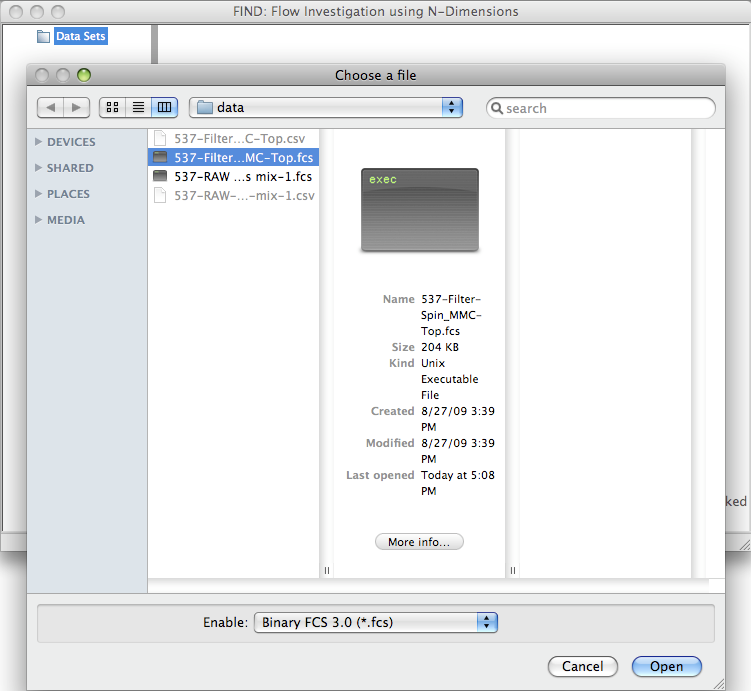

Data
=====
Currently, the main source FIND accepts for data are 
`FCS 3.0 <http://www.isac-net.org/index.php?option=com_content&task=view&id=101&Itemid=150>`_
formatted data files. These files contain a great deal of useful information 
that FIND can make use of to provide a better user experience. However, FIND can also open 
CSV (comma separated value) files in the following format::

	"FSC-A","SSC-A","PI (live-dead)-A","GFP-A"
	389.850006103516,2.46000003814697,-14.7600002288818,1739.21997070312
	.
	.
	.
	
Additional file formats may be used as a source if a 
`plugin <http://www.justicelab.org/find/plugins>`_ is available to handle them.

Opening files
--------------
Flow Cytometry data files are opened through the File >> Open... menu item in the FIND interface. 
As mentioned in the previous section, the main data source are FCS 3.0 files, and those are enabled 
for selection by default.

more text